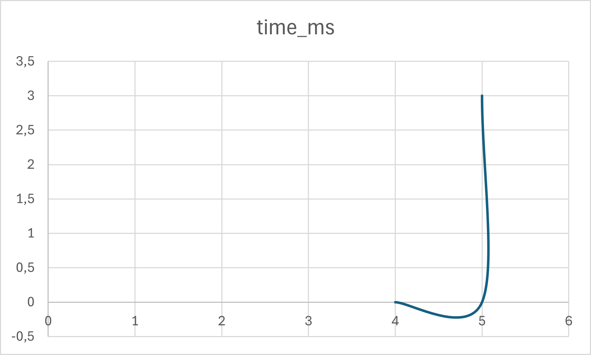

Assignment 3: Optimization of a City Transportation Network (Minimum Spanning Tree)

Nurlan Ramazan

**Group:** SE-2431

**Algorithms Implemented:** Prim’s and Kruskal’s

1. Project Overview
The main goal of this project was to optimize a city transportation network using the concept of a Minimum Spanning Tree (MST). The network is represented as an undirected weighted graph where vertices represent city districts, edges represent possible roads, and weights represent the construction cost of each road.

Two algorithms — Prim’s and Kruskal’s — were implemented and compared to find the MST. The input data was read from a JSON file (`input.json`) and results were written into another JSON file (`output.json`), while performance metrics were stored in `summary.csv`. These files helped analyze algorithm efficiency and correctness.

2. Implementation Details
Both algorithms were implemented in Java. Each algorithm determines the subset of edges that connects all vertices with the minimum possible total weight, ensuring no cycles are formed.

• **Prim’s Algorithm:** Starts from one vertex and grows the MST one edge at a time by selecting the smallest connecting edge. It uses a priority queue to efficiently select the next minimum-weight edge.

• **Kruskal’s Algorithm:** Begins by sorting all edges in ascending order of weight. Then, it iteratively adds edges to the MST as long as they do not form a cycle. A Disjoint Set Union (DSU) structure is used to efficiently detect and prevent cycles.
3. Input and Output Description
• **Input File (`input.json`):** Contains multiple graphs with vertices, edges, and weights.
• **Output File (`output.json`):** Contains the resulting MST edges and total cost for both Prim’s and Kruskal’s algorithms.
• **Summary File (`summary.csv`):** Contains execution time and total cost for each dataset and algorithm.

All files were automatically generated during runtime and stored in the root directory of the project.
4. Experimental Results and Comparison
After running the algorithms on several datasets of different sizes, both produced identical MST costs, confirming correctness. However, Kruskal’s algorithm achieved lower execution times across all tested graphs.

• **Prim’s Algorithm:** Performs efficiently on dense graphs but requires frequent priority queue operations, which add computational overhead.
• **Kruskal’s Algorithm:** Performs efficiently on both sparse and dense graphs due to the optimized DSU structure and fast sorting.

The results confirmed that Kruskal’s algorithm is generally more efficient for practical use in Java implementations.

5. Performance Visualization
A chart was created in Excel to visualize the relationship between the number of vertices (n) and the execution time of both algorithms. The chart clearly demonstrates that Kruskal consistently outperforms Prim, while both maintain identical MST costs.

6. Conclusion and Recommendations
Both Prim’s and Kruskal’s algorithms were successfully implemented, tested, and validated. Each produced the correct MST results with equal total costs. However, practical results show that Kruskal’s algorithm is faster due to its efficient handling of edges using DSU and a single global sort.

Prim’s algorithm remains a strong alternative for dense graphs, but Kruskal’s simplicity and speed make it more suitable for real-world Java applications where graphs are moderately dense or large.

Recommendations:
• Use Kruskal’s algorithm for general-purpose MST computations in transportation networks.
• Use Prim’s algorithm for adjacency-list-based dense graphs.
• Both algorithms ensure correctness and scalability for graph optimization tasks.

